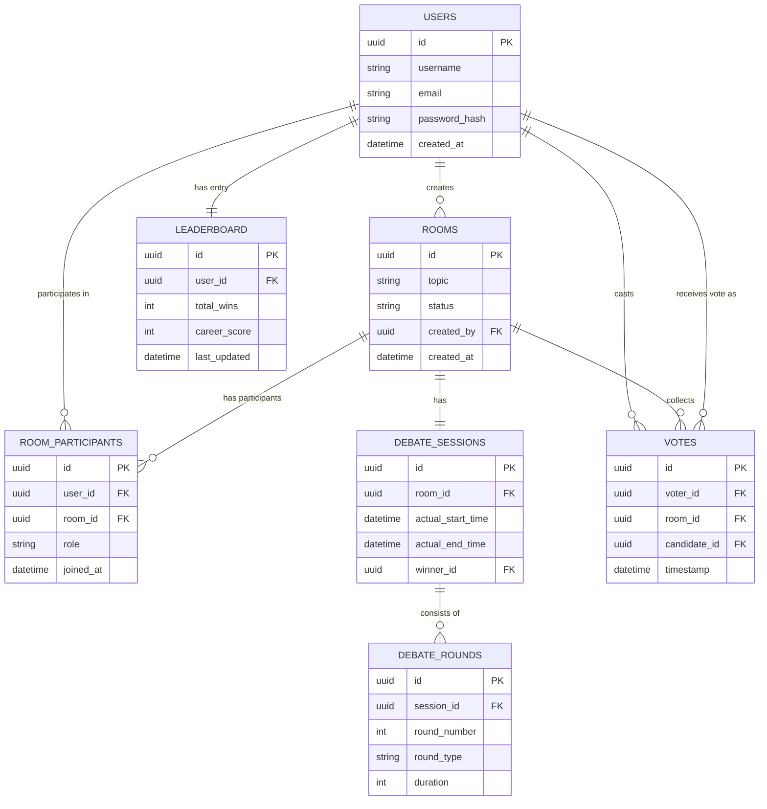

```mermaid
erDiagram
    USERS ||--o{ ROOMS : "creates"
    USERS ||--o{ ROOM_PARTICIPANTS : "participates in"
    ROOMS ||--o{ ROOM_PARTICIPANTS : "has participants"
    
    ROOMS ||--|| DEBATE_SESSIONS : "has"
    DEBATE_SESSIONS ||--o{ DEBATE_ROUNDS : "consists of"
    
    USERS ||--o{ VOTES : "casts"
    ROOMS ||--o{ VOTES : "collects"
    USERS ||--o{ VOTES : "receives vote as"
    
    USERS ||--|| LEADERBOARD : "has entry"

    USERS {
        uuid id PK
        string username
        string email
        string password_hash
        datetime created_at
    }

    ROOMS {
        uuid id PK
        string topic
        string status
        uuid created_by FK
        datetime created_at
    }

    ROOM_PARTICIPANTS {
        uuid id PK
        uuid user_id FK
        uuid room_id FK
        string role
        datetime joined_at
    }

    DEBATE_SESSIONS {
        uuid id PK
        uuid room_id FK
        datetime actual_start_time
        datetime actual_end_time
        uuid winner_id FK
    }

    DEBATE_ROUNDS {
        uuid id PK
        uuid session_id FK
        int round_number
        string round_type
        int duration
    }

    VOTES {
        uuid id PK
        uuid voter_id FK
        uuid room_id FK
        uuid candidate_id FK
        datetime timestamp
    }

    LEADERBOARD {
        uuid id PK
        uuid user_id FK
        int total_wins
        int career_score
        datetime last_updated
    }
```
