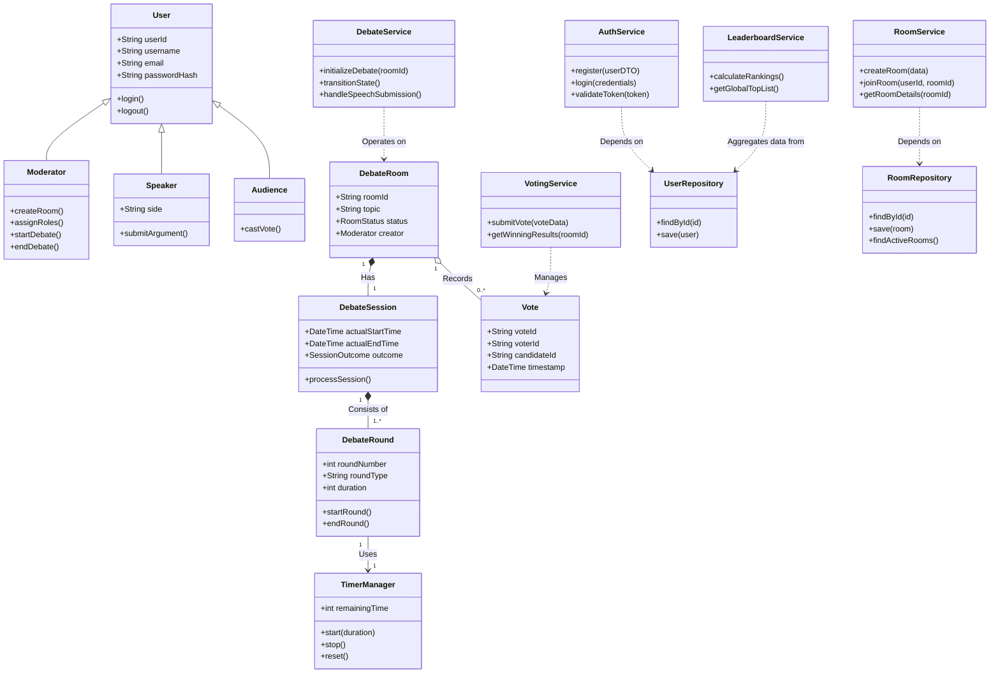

```mermaid
classDiagram
    %% Inheritance: User and its subclasses
    class User {
        +String userId
        +String username
        +String email
        +String passwordHash
        +login()
        +logout()
    }

    class Moderator {
        +createRoom()
        +assignRoles()
        +startDebate()
        +endDebate()
    }

    class Speaker {
        +String side
        +submitArgument()
    }

    class Audience {
        +castVote()
    }

    User <|-- Moderator
    User <|-- Speaker
    User <|-- Audience

    %% Composition and Multiplicity: Room and Session logic
    class DebateRoom {
        +String roomId
        +String topic
        +RoomStatus status
        +Moderator creator
    }

    class DebateSession {
        +DateTime actualStartTime
        +DateTime actualEndTime
        +SessionOutcome outcome
        +processSession()
    }

    class DebateRound {
        +int roundNumber
        +String roundType
        +int duration
        +startRound()
        +endRound()
    }

    DebateRoom "1" *-- "1" DebateSession : Has
    DebateSession "1" *-- "1..*" DebateRound : Consists of

    %% Association: Votes and Timer
    class Vote {
        +String voteId
        +String voterId
        +String candidateId
        +DateTime timestamp
    }

    class TimerManager {
        +int remainingTime
        +start(duration)
        +stop()
        +reset()
    }

    DebateRoom "1" o-- "0..*" Vote : Records
    DebateRound "1" --> "1" TimerManager : Uses

    %% Service Layer (Business Logic)
    class AuthService {
        +register(userDTO)
        +login(credentials)
        +validateToken(token)
    }

    class RoomService {
        +createRoom(data)
        +joinRoom(userId, roomId)
        +getRoomDetails(roomId)
    }

    class DebateService {
        +initializeDebate(roomId)
        +transitionState()
        +handleSpeechSubmission()
    }

    class VotingService {
        +submitVote(voteData)
        +getWinningResults(roomId)
    }

    class LeaderboardService {
        +calculateRankings()
        +getGlobalTopList()
    }

    %% Repository Layer (Data Access)
    class UserRepository {
        +findById(id)
        +save(user)
    }

    class RoomRepository {
        +findById(id)
        +save(room)
        +findActiveRooms()
    }

    %% Dependencies and Layout
    AuthService ..> UserRepository : Depends on
    RoomService ..> RoomRepository : Depends on
    DebateService ..> DebateRoom : Operates on
    VotingService ..> Vote : Manages
    LeaderboardService ..> UserRepository : Aggregates data from
```
