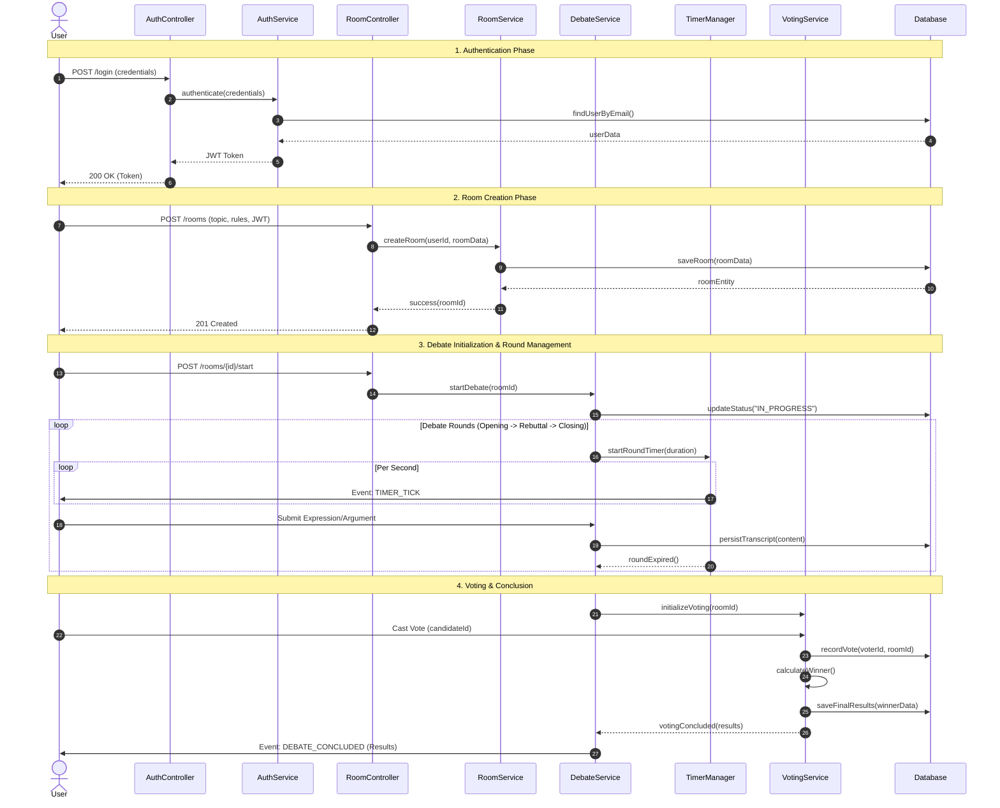

# Sequence Diagram: Full Debate Session Lifecycle

## Architectural Interaction Breakdown
1. **Authentication**: Handled by dedicated `AuthController` and `AuthService` to ensure security is abstracted from business logic.
2. **Room Management**: `RoomController` orchestrates the setup phase, ensuring only authorized users can create structured rooms.
3. **Domain Orchestration**: `DebateService` acts as the primary coordinator, delegating time-keeping to `TimerManager` and voting logic to `VotingService`.
4. **Data Integrity**: All state transitions and transcripts are synchronized with the `Database` through the service layer, maintaining a strict audit trail.
5. **Separation of Concerns**: Each service is responsible for a single domain (Auth, Room, Timing, Voting), adhering to SOLID principles.
